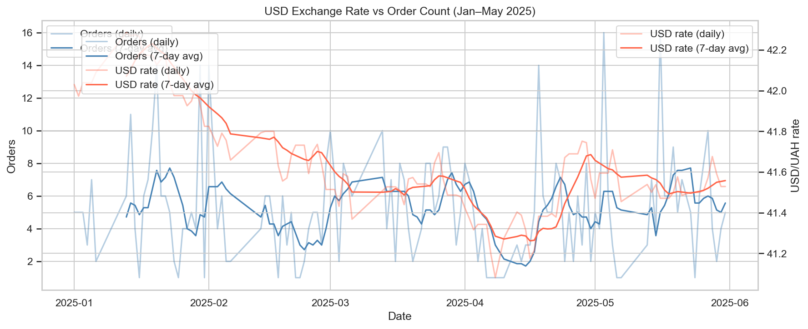

# Shop&Joy: E-Commerce Sales Analysis 2023–2025

> Note: this project uses a synthetic dataset created for educational purposes.

## Business Context

**Shop&Joy** is a fast-growing Ukrainian online store selling electronics, home goods, and clothing.

The CEO noticed an alarming pattern (Jan–May 2025): some days sales hit records, others drop by nearly 2×. Three teams had competing explanations:
- **Marketing**: external factors — competitors, USD exchange rate fluctuations
- **Logistics**: supplier and stock issues
- **Commercial Director**: low-margin products and low-value customers dragging revenue down

**Goal:** find the real drivers of sales instability and deliver data-backed recommendations.

---

## Data Sources

| Source | Format | Description |
|--------|--------|-------------|
| `orders.parquet` | Parquet | ~9,000 order transactions (2023–2025) |
| `products.csv` | CSV | 500 products: categories, prices, margins |
| `sessions.db` | SQLite | 450 customers + 30,000 web sessions |
| NBU API | REST | Daily USD/UAH exchange rates |

---

## Stack

`Python` · `Pandas` · `NumPy` · `Matplotlib` · `Seaborn` · `SQLite` · `REST API`

---

## Data Preparation

- Merged 4 data sources into a single analytical dataset
- Fixed mixed data types (e.g. Russian word `"пять"` entered instead of digit `5`)
- Removed duplicates and statistical outliers (IQR method)
- Validated data integrity: checked calculated vs. reported order totals
- Detected and handled future dates, invalid discounts, negative session durations

---

## Key Findings

### 1. USD Exchange Rate vs Sales



Correlation between USD rate and order count: **r = −0.04**. Correlation with average check: **r = −0.07** — no meaningful linear relationship detected in either metric.

The Marketing team's hypothesis was not confirmed. USD fluctuations do not explain the observed sales instability.

---

### 2. Product Category Margins

| Category | Margin % | Revenue Share |
|----------|----------|---------------|
| Electronics | 12.1% | 40.6% |
| Home | 11.5% | 29.9% |
| Clothing | 11.5% | 29.5% |


All categories show similar margin levels (11–12%). No underperforming category was identified.

The Commercial Director's margin hypothesis was not confirmed.

---

### 3. Acquisition Channels — LTV


| Channel | Avg LTV (UAH) | Customers |
|---------|--------------|-----------|
| Paid Search | 478,704 | 40 |
| Organic | 385,873 | 71 |
| Referral | 368,843 | 44 |
| Email | 311,456 | 23 |
| Social | 258,997 | 31 |
| Affiliate | 190,414 | 11 |

Paid Search delivers 2.5× higher average LTV than Affiliate. Channel mix is a meaningful driver of customer value.

---

### 4. RFM Customer Segmentation


| Segment | Customers | Avg Spend (UAH) | Avg Orders |
|---------|-----------|-----------------|------------|
| VIP | 103 | 4,132,664 | 64.6 |
| Loyal | 28 | 794,558 | 12.7 |
| At Risk | 59 | 460,888 | 7.6 |
| Regular | 193 | 315,249 | 4.9 |
| Occasional/Sleeping | 59 | 68,513 | 1.6 |

103 VIP customers (23% of base) drive the majority of revenue with an average of 64.6 orders per customer.

---

### 5. Seasonality (2023–2024)


Consistent patterns across both years:
- **October**: strongest month (+13.7% above average)
- **February**: −10.9% · **April**: −9.2% · **July**: −6.2%

---

### 6. Session Conversion by Channel

| Channel | Conversion Rate |
|---------|----------------|
| Email | 28.6% |
| Referral | 26.9% |
| Paid Search | 24.2% |
| Organic | 24.2% |

Conversion by device is uniform: Desktop 26.7%, Mobile 25.0%, Tablet 24.2% — no UX issues detected.

---

## Business Impact

The analysis identified customer segmentation and acquisition channel mix as the primary drivers of revenue variability — not external macroeconomic factors such as USD exchange rate.

The findings support:
- more efficient marketing budget allocation (shift spend from Affiliate/Social toward Paid Search and Organic)
- targeted retention campaigns for At-Risk customers (59 customers, avg 7.6 orders each)
- improved seasonal inventory planning around October peak and July/February dips

---

## Recommendations

1. **Loyalty program** — launch for 103 VIP customers immediately; run win-back campaigns for 59 At-Risk customers inactive 13+ months
2. **Channel budget** — reallocate from Social and Affiliate to Paid Search, Organic, Referral (2–2.5× higher LTV)
3. **Seasonal promotions** — plan campaigns for February, April, July; build inventory for October peak
4. **Electronics focus** — 40.6% of revenue and highest margin — prioritise stock availability and upsell
5. **Email optimisation** — highest conversion rate (28.6%) but moderate LTV; improve audience targeting to attract higher-value segments

---

## Project Structure

```
├── shopjoy_sales_analysis.ipynb   # Full analysis with code and visualisations
├── products.csv                   # Product catalogue
├── orders.parquet                 # Order transactions
├── sessions.db                    # SQLite: customers & sessions
├── requirements.txt               # Python dependencies
├── screenshots/                   # Charts used in README
└── README.md
```

---

## Author

**Jenni Kloos** — Data Analyst | BI & Reporting  
Leipzig, Germany · [LinkedIn](https://www.linkedin.com/in/jenni-kloos)
